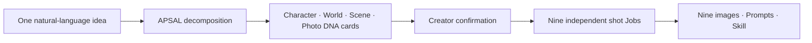

<p align="center">
  
</p>

<h1 align="center">APSAL — Open Photography Protocol</h1>

<p align="center">
  <strong>Structure the elements. Build the world.</strong><br>
  An open visual language for turning creative intent into reproducible photographic worlds.
</p>

<p align="center">
  <a href="https://github.com/henyjone/apsal-open/actions/workflows/ci.yml"></a>
  <a href="https://github.com/henyjone/apsal-open/releases/latest"></a>
  <a href="LICENSE"></a>
  <a href="CONTENT_LICENSE.md"></a>
  <a href="protocol/APSAL_OPEN_PROTOCOL.md"></a>
  <a href="plugins/apsal-studio"></a>
</p>

<p align="center">
  <a href="#install-the-codex-plugin"><strong>Install Plugin</strong></a> ·
  <a href="#30-second-start"><strong>Quick Start</strong></a> ·
  <a href="protocol/APSAL_OPEN_PROTOCOL.md"><strong>Read Protocol</strong></a> ·
  <a href="docs/monograph/README.md"><strong>Read the Method</strong></a> ·
  <a href="README.zh-CN.md"><strong>中文文档</strong></a>
</p>

---

## AI photography is worldbuilding

AI photography is not the act of writing one enormous prompt. It is the act of defining a world: its subjects, space, light, time, visual laws, events, and points of view—then expressing those elements in a language that can be composed, tested, versioned, and reproduced.

APSAL is that open visual language. It turns creative intuition into explicit elements, relationships, and constraints, then compiles them into independent photographic Jobs.



| ELEMENTS | GRAMMAR | WORLD | CAMERA | OUTPUT |
|---|---|---|---|---|
| Identity, space, light, color, style, action | Dependencies, locks, variants, continuity | A coherent visual system with memory | One point of view per independent Job | Validated JSON, prompts and installable Skills |

> **Prompting describes an image. APSAL defines the world that makes the image possible.**

## The open system behind the idea

The protocol defines 13 composable module roles. The DNA Registry stores reusable visual elements. The engine resolves versions and dependencies, validates identity and continuity, and packages the result without requiring a hosted service.

## Install the Codex plugin

The Git marketplace is the recommended path. It installs the protocol, official DNA Registry, local engine, interactive card service, validators, and Skill packager together.

```bash
codex plugin marketplace add henyjone/apsal-open --ref main
codex plugin add apsal-studio@apsal-open
```

Restart Codex or open a new task after installation. You can also download the pinned ZIP from the [latest release](https://github.com/henyjone/apsal-open/releases/latest).

## 30-second start

Ask Codex:

> Create a nine-shot Eastern-minimalist window portrait series.

APSAL Studio will:

1. Decompose the sentence and present Character, World, Scene, and Photo DNA cards.
2. Let you choose, revise in natural language, or redesign one scene without hand-writing data files.
3. Show the nine-shot overview and wait for your confirmation.
4. Confirm the live-action contract and reference uses, then generate nine independent 9:16 images, save the Prompts, or export a reproducible Skill.

Creators never need to see JSON or YAML. Protocol 0.3 keeps them in the local artifact layer for reuse, versioning, compilation and QA. Studio 0.5 binds actual reference images and places a live-action photography contract before scene style. Image generation requires one explicit confirmation and always runs one Job per image; one failed image does not force successful images to run again.

### Where your DNA lives

| Layer | Location | Purpose |
|---|---|---|
| Official | inside the installed plugin | read-only, rights-cleared starter DNA and previews |
| Personal | `~/.apsal/` or `APSAL_HOME` | reusable DNA and the private content-addressed reference Vault |
| Project | `<project>/.apsal/` | drafts, project DNA, frozen themes, exact Prompts, runs, outputs and QA |

Resolution is project → personal → official. A confirmed draft becomes project DNA. It moves to personal DNA only when you explicitly choose “Save to My DNA.” Original references stay in `~/.apsal/vault/sha256/` and never enter DNA JSON or Git. A local exported Skill contains sanitized copies plus a purpose-and-rights manifest so the image model can actually see them. If redistribution rights are unresolved, the Skill is `private_only` and public export fails.

Behind the interface, a finalized theme and each real run retain complete lineage:

```text
.apsal/themes/<theme-id>/<version>/   source, canonical artifact, three compiled targets, 18 Prompt files
.apsal/runs/<run-id>/                 exact submitted Prompts, nine outputs, retries and per-shot QA
```

### Real people, real references, native 4K

New Studio themes default to live-action adult-human photography and nine independent 9:16, 2160×3840 high-quality PNG Jobs. Handmade, crayon, painted, or theatrical language may describe sets and props; it must not turn the person into an illustration, doll, mannequin, wax figure, or 3D character.

Provider-native 4K execution is optional: set `OPENAI_API_KEY`, select `openai-image-api` with `gpt-image-2`, and APSAL sends nine sequential `n: 1` requests. Jobs with references use Image Edits; other Jobs use Generations. Every returned file must be exactly 2160×3840. Codex ImageGen is not presented as a guaranteed native-4K fallback. GPT Image 2 supports this size, but output above 2K is experimental; see the [official OpenAI guide](https://developers.openai.com/api/docs/guides/image-generation).

Model visual QA checks the generated medium, skin, eyes, hands, anatomy, optics, light, and material response. Human visual QA remains a separate pending decision; passing schemas or Prompts never proves photographic quality.

## Use the engine directly

No account, hosted API, or model key is required for validation and packaging.

```bash
python3 plugins/apsal-studio/scripts/apsal.py init
python3 plugins/apsal-studio/scripts/apsal.py session start "Create a nine-shot Eastern-minimalist window portrait series"
python3 plugins/apsal-studio/scripts/apsal.py registry search --stage character
python3 plugins/apsal-studio/scripts/apsal.py catalog
python3 plugins/apsal-studio/scripts/apsal.py validate examples/quiet-window/theme.apsal.yaml
python3 plugins/apsal-studio/scripts/apsal.py normalize examples/quiet-window/theme.apsal.yaml -o build/theme.apsal.json
python3 plugins/apsal-studio/scripts/apsal.py explain examples/quiet-window/theme.apsal.yaml --path shots.SHOT_04.framing
python3 plugins/apsal-studio/scripts/apsal.py compile examples/quiet-window/theme.apsal.yaml --target design -o build/design.json
python3 plugins/apsal-studio/scripts/apsal.py compile examples/quiet-window/theme.apsal.yaml --target image -o build/image.json
python3 plugins/apsal-studio/scripts/apsal.py compile examples/quiet-window/theme.apsal.yaml --target qa -o build/qa.json
python3 plugins/apsal-studio/scripts/apsal.py check-sync examples/quiet-window
python3 plugins/apsal-studio/scripts/apsal.py pack examples/quiet-window/theme.apsal.yaml -o build
python3 plugins/apsal-studio/scripts/apsal.py validate-package path/to/extracted-package
```

Native-4K execution is also available through `session finalize`, `run --confirm`, `run-execute`, and `run-model-qa`; use `python3 plugins/apsal-studio/scripts/apsal.py --help` for the local workflow. Packaging and validation remain fully offline.

## Choose your path

| Creator | Developer | Contributor |
|---|---|---|
| Describe a world, choose visual DNA cards, then generate nine independent images. | Build against the [protocol](protocol/APSAL_OPEN_PROTOCOL.md), [schemas](plugins/apsal-studio/assets/schemas), local MCP and offline CLI. | Submit original DNA through the [DNA template](https://github.com/henyjone/apsal-open/issues/new?template=dna-submission.yml) and follow [CONTRIBUTING.md](CONTRIBUTING.md). |

## Open does not mean unlicensed

The protocol and reference engine are Apache-2.0. Official starter DNA and examples are CC BY 4.0. An individual theme is public only when it carries its own license, attribution, provenance, version lineage, checksums, and honest QA state. Every reference has an independent license and consent record; it never inherits CC BY 4.0 from theme text. Private references, credentials, personal media, and unlicensed source material are excluded from this repository and public releases.

Static validation proves structure and reproducibility—not generated-image quality. Visual QA requires human evidence.

## Project map

- [Building Visible Worlds — APSAL methodology monograph](docs/monograph/README.md)
- [Semantic Contract RFC](protocol/RFC-0001-SEMANTIC-CONTRACT.md)
- [Local Registry and conversational authoring RFC](protocol/RFC-0002-LOCAL-REGISTRY-AND-CONVERSATIONAL-AUTHORING.md)
- [Reference binding, live-action and native-4K RFC](protocol/RFC-0003-REFERENCE-BINDING-LIVE-ACTION-AND-NATIVE-4K.md)
- [APSAL Studio 0.5 release and installation notes](docs/releases/0.5.0.md)
- [Quiet Window Semantic Contract pilot](examples/quiet-window/theme.apsal.yaml)
- [APSAL Open Protocol](protocol/APSAL_OPEN_PROTOCOL.md)
- [APSAL Studio plugin](plugins/apsal-studio)
- [Starter DNA Registry](plugins/apsal-studio/assets/dna/catalog.json)
- [Semantic example theme](examples/quiet-window/theme.apsal.yaml)
- [Contribution guide](CONTRIBUTING.md)
- [Governance](GOVERNANCE.md)
- [Security policy](SECURITY.md)
- [Latest release](https://github.com/henyjone/apsal-open/releases/latest)

<p align="center"><strong>Ideas become assets. Assets become reproducible photo systems.</strong></p>
