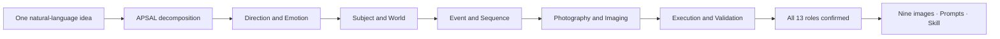

<p align="center">
  
</p>

<p align="center">
  <strong>CONTACT</strong><br>
  Email: <a href="mailto:henyjone@gmail.com">henyjone@gmail.com</a> &nbsp;·&nbsp; WeChat: <strong>vip888666</strong>
</p>

<h1 align="center">APSAL — Open Photography Protocol</h1>

<p align="center">
  <strong>Structure the elements. Build the world.</strong><br>
  An open visual language for turning creative intent into reproducible photographic worlds.
</p>

<p align="center">
  <a href="https://github.com/henyjone/apsal-open/actions/workflows/ci.yml"></a>
  <a href="https://github.com/henyjone/apsal-open/releases/latest"></a>
  <a href="LICENSE"></a>
  <a href="CONTENT_LICENSE.md"></a>
  <a href="protocol/APSAL_OPEN_PROTOCOL.md"></a>
  <a href="plugins/apsal-studio"></a>
</p>

<p align="center">
  <a href="#install-the-codex-plugin"><strong>Install Plugin</strong></a> ·
  <a href="#30-second-start"><strong>Quick Start</strong></a> ·
  <a href="docs/USAGE_GUIDE.md"><strong>Complete Guide</strong></a> ·
  <a href="protocol/APSAL_OPEN_PROTOCOL.md"><strong>Read Protocol</strong></a> ·
  <a href="docs/monograph/README.md"><strong>Read the Method</strong></a> ·
  <a href="docs/USAGE_GUIDE.zh-CN.md"><strong>中文使用手册</strong></a>
</p>

---

## AI photography is worldbuilding

AI photography is not the act of writing one enormous prompt. It is the act of defining a world: its subjects, space, light, time, visual laws, events, and points of view—then expressing those elements in a language that can be composed, tested, versioned, and reproduced.

APSAL is that open visual language. It turns creative intuition into explicit elements, relationships, and constraints, then compiles them into independent photographic Jobs.



| ELEMENTS | GRAMMAR | WORLD | CAMERA | OUTPUT |
|---|---|---|---|---|
| Identity, space, light, color, style, action | Dependencies, locks, variants, continuity | A coherent visual system with memory | One point of view per independent Job | Validated JSON, prompts and installable Skills |

> **Prompting describes an image. APSAL defines the world that makes the image possible.**

## The open system behind the idea

The protocol defines 13 composable roles. The DNA Registry stores seven kinds of reusable visual knowledge. Studio exposes every role through five complete text-card layers and summarizes progress with five localized semantic thumbnails, so props, emotion, lighting, color, post-processing and QA cannot disappear inside a vague “Photo style” choice. DNA choice cards remain text-only; stage thumbnails explain progress and never become image-generation inputs. The engine explains which DNA fits the scene, remembers only creator-approved personal knowledge, resolves versions and dependencies, and packages themes or standalone DNA without requiring a hosted service.

| Creator layer | Required APSAL roles | Registry DNA recommendations |
|---|---|---|
| Direction | Content, Emotion | none; proposed from the brief |
| Worldbuilding | Subject, World, Look | Character, Environment |
| Narrative | Event, Sequence | Composition, Shot |
| Image | Camera, Light, Style, Color/Post | Style, Lighting |
| Delivery | Job, Quality Control | QA |

The five layers are the conversation order, the thirteen elements are protocol roles, and the seven DNA types are reusable assets.

## Install the Codex plugin

The Git marketplace is the recommended path. It installs the protocol, official DNA Registry, local engine, interactive card service, validators, and Skill packager together.

```bash
codex plugin marketplace add henyjone/apsal-open --ref main
codex plugin add apsal-studio@apsal-open
```

Restart Codex or open a new task after installation. You can also download the pinned ZIP from the [latest release](https://github.com/henyjone/apsal-open/releases/latest).

APSAL Studio is fully bilingual. It follows the language of the current Codex conversation: an English brief opens English cards and guidance; a Chinese brief opens creator-facing Chinese cards with no exposed English machine labels. Every element card is fully populated with the design proposal, rationale, adjustable directions, values, expected result, invariants and acceptance criteria. Important titles, proposals, values, recommendation reasons and primary actions use an accessible celadon highlight hierarchy. There is no mandatory installation-time language screen. Only a genuinely ambiguous or mixed first message triggers the concise question “English or 中文?”. You can ask to switch at any time; the choice is stored in the local session and never changes the theme, DNA, or Prompt digests.

New nine-image themes default to **Chaptered Variation**: three related scenes, three coordinated looks, nine action-led body states and functional multi-focal coverage, held together by one identity, live-action medium, world grammar and color system. Choose **Continuous Narrative** when the same scene, look and event state should persist. Both choices appear as accessible buttons in the first card; selecting one revises the proposal before confirmation.

### APSAL Studio Desktop 0.3.0

This repository includes [`apps/apsal-studio`](apps/apsal-studio), an APSAL creative project library and visual frontend for the Codex plugin. Its home screen imports rights-scoped reference groups and presents covers, search, favorites, archives, lineage, and share status. Inside a project it preserves the editorial five-layer/thirteen-role workflow. `.apsal/` remains the semantic source; `~/.apsal/library/` is only a rebuildable search and thumbnail projection. Studio contains no ComfyUI, MLX, model runtime, or provider image-generation action.

```bash
cd apps/apsal-studio
npm ci
npm run build
npm run test:electron
npm run desktop:start
```

Studio can establish a multi-reference root project; Codex pulls the per-image analysis Jobs, builds the APSAL theme, and performs image generation. A complete headless Codex/MCP path remains available. Both routes call the same Engine. Automatic mode may skip routine design confirmations, but never reference rights, real-person identity, public sharing, or social publication confirmation.

New Studio projects default to `~/APSAL Projects/<name>-<project_id>/`. Every series, scene, camera, light, styling, or nine-shot expansion creates a child project with a parent snapshot digest and source assets; the parent stays unchanged.

## 30-second start

Ask Codex:

> Create a nine-shot Eastern-minimalist window portrait series.

APSAL Studio will:

1. Ask once whether to open and link the APSAL Studio frontend or continue only in Codex.
2. Confirm what the work is about, choose Chaptered Variation or Continuous Narrative, classify its emotional direction and define how that emotion evolves.
3. Move through Subject/World/Look, Event/Sequence, Camera/Light/Style/Color-Post and Job/Quality Control as complete proposal cards. Unless another subject is specified, APSAL proposes a poised East Asian adult female protagonist who supports classical, contemporary, editorial and ceremonial styling while keeping identity locked.
4. Explicitly confirm the three-scene/three-look chapter plan or the single-scene continuous lock; nine distinct actions and body states; functional focal perspectives; props and ownership; light; color/post; and rejection rules. Revise any one element in natural language or click a proposed direction.
5. Suggest controlled tags for new DNA, then ask whether to save it to My DNA, keep it in this project, or decide later.
6. Show all thirteen decisions and the nine-shot overview, then automatically package every Prompt, real reference, five-stage thumbnail and usage guide. If real references exist, one is designated as the rights-scoped core visual anchor; semantic thumbnails remain strictly separate. With one confirmation, Codex generates the nine independent 9:16 images one at a time.

Creators never need to see JSON or YAML. APSAL Open Protocol is 0.4.0; Project Protocol, Engine, and Codex plugin are 0.16.0; Studio Desktop is 0.3.0; the Semantic Contract remains 0.3.0. Codex and Studio use one `.apsal/` source of truth. A project can export Prompts, Skill, QA, checksums, and a static showcase before Codex performs image generation one Job at a time.

For a reference-led project, choose **New reference project** in the library. Codex separates observable facts from creative inference, analyzes all thirteen roles per image, and then synthesizes common visual DNA, conflicts, complements, and recommended directions. It never identifies a person and cannot lock a real face without explicit authorization.

For the complete installation, five-layer conversation, DNA/reference, generation, package-installation and troubleshooting workflow, follow the [APSAL Studio complete usage guide](docs/USAGE_GUIDE.md) or the [中文完整使用手册](docs/USAGE_GUIDE.zh-CN.md).

### Already have an old APSAL ZIP?

Attach it to Codex and say:

> Open this APSAL package and generate the first image.

Studio detects `run.json`, preserves its lineage but ignores historical API/model execution fields, recovers all Prompts, searches the ZIP and your private Vault for reference images by SHA-256, creates a new private Codex Prompt/Skill package, and returns SHOT_01 ready for Codex image generation. You do not need to extract the ZIP, inspect JSON, repair old absolute paths, or install an API runner. If a reference cannot be recovered, Studio asks only for that missing image and verifies it against the recorded digest.

### Where your DNA lives

| Layer | Location | Purpose |
|---|---|---|
| Official | inside the installed plugin | read-only, rights-cleared starter DNA and previews |
| Personal | `~/.apsal/` or `APSAL_HOME` | reusable DNA and the private content-addressed reference Vault |
| Extension | `~/.apsal/extensions/` | installed, immutable community DNA Packs |
| Project | `<project>/.apsal/` | drafts, project DNA, frozen themes, exact Prompts, runs, outputs and QA |

Resolution is project → personal → extension → official. A confirmed draft becomes project DNA. It moves to personal DNA only when you explicitly choose “Save to My DNA.” Selection and outcome memory stays locally under `~/.apsal/usage/`; raw briefs are not stored. Original references stay in `~/.apsal/vault/sha256/` and never enter DNA JSON or Git. A local exported Skill contains sanitized copies plus a purpose-and-rights manifest and designates one real reference as its core visual anchor when available. If redistribution rights are unresolved, the Skill is `private_only` and public export fails. Localized SVGs under `assets/previews/` summarize the five stages but are marked as non-generation assets and never sent to the image model.

Behind the interface, a finalized theme and each real run retain complete lineage:

```text
.apsal/themes/<theme-id>/<version>/   source, canonical artifact, three compiled targets, 18 Prompt files
.apsal/runs/<run-id>/                 exact submitted Prompts, nine outputs, retries and per-shot QA
```

### Real people, real references, Codex-native generation

New Studio themes default to live-action adult-human photography and nine independent 9:16 high-quality image requests. Handmade, crayon, painted, or theatrical language may describe sets and props; it must not turn the person into an illustration, doll, mannequin, wax figure, or 3D character.

APSAL Studio is a Codex plugin, so it does not configure provider endpoints, read an image API key, or send HTTP generation requests. It freezes one exact full Prompt per shot and passes the permitted reference images to Codex's built-in image generation. The 2160×3840 delivery size remains a creative request in the package, not a guaranteed returned pixel size; the run records actual format and dimensions only when Codex exposes them.

Model visual QA checks the generated medium, skin, eyes, hands, anatomy, optics, light, and material response. Human visual QA remains a separate pending decision; passing schemas or Prompts never proves photographic quality.

### A Registry that learns—with permission

Recommendations combine controlled semantic tags, scene facets, explicit dependencies, QA, rights, Registry scope and private outcome history. Every card explains why it matches. New or revised project DNA triggers one explicit memory choice; APSAL never silently adds it to the personal Registry.

Reusable DNA can be exported independently from a theme as a deterministic Extension Pack. Public packs require one namespace, confirmed tags, rights-cleared DNA and previews, attribution, resolved dependencies and SHA-256. Install a pinned GitHub Release pack with:

```bash
python3 plugins/apsal-studio/scripts/apsal.py registry install 'github:owner/repo@v1.0.0#my-pack-v1.0.0.zip'
```

Installed packs are read-only and cannot override official or existing ID/version pairs.

## Use the engine directly

No account, hosted API, or model key is required for validation and packaging.

```bash
python3 plugins/apsal-studio/scripts/apsal.py init
python3 plugins/apsal-studio/scripts/apsal.py import-run path/to/legacy-run.zip
python3 plugins/apsal-studio/scripts/apsal.py session start "Create a nine-shot Eastern-minimalist window portrait series"
python3 plugins/apsal-studio/scripts/apsal.py registry recommend-layer "quiet Eastern-minimalist window portrait" --layer worldbuilding
python3 plugins/apsal-studio/scripts/apsal.py session layer-show SESSION-ID --layer direction
python3 plugins/apsal-studio/scripts/apsal.py registry search --stage character
python3 plugins/apsal-studio/scripts/apsal.py catalog
python3 plugins/apsal-studio/scripts/apsal.py validate examples/quiet-window/theme.apsal.yaml
python3 plugins/apsal-studio/scripts/apsal.py normalize examples/quiet-window/theme.apsal.yaml -o build/theme.apsal.json
python3 plugins/apsal-studio/scripts/apsal.py explain examples/quiet-window/theme.apsal.yaml --path shots.SHOT_04.framing
python3 plugins/apsal-studio/scripts/apsal.py compile examples/quiet-window/theme.apsal.yaml --target design -o build/design.json
python3 plugins/apsal-studio/scripts/apsal.py compile examples/quiet-window/theme.apsal.yaml --target image -o build/image.json
python3 plugins/apsal-studio/scripts/apsal.py compile examples/quiet-window/theme.apsal.yaml --target qa -o build/qa.json
python3 plugins/apsal-studio/scripts/apsal.py check-sync examples/quiet-window
python3 plugins/apsal-studio/scripts/apsal.py pack examples/quiet-window/theme.apsal.yaml -o build
python3 plugins/apsal-studio/scripts/apsal.py validate-package path/to/extracted-package
```

Use `session finalize` to create the theme plus its Codex Prompt/Skill ZIP, `run --confirm` to prepare a resumable run, `run-next` to inspect the next frozen Codex Job, and `run-model-qa` to preserve visual review. The CLI never generates through a provider; image creation happens in Codex. Packaging and validation remain fully offline.

## Choose your path

| Creator | Developer | Contributor |
|---|---|---|
| Describe a world, choose visual DNA cards, then generate nine independent images. | Build against the [protocol](protocol/APSAL_OPEN_PROTOCOL.md), [schemas](plugins/apsal-studio/assets/schemas), local MCP and offline CLI. | Submit original DNA through the [DNA template](https://github.com/henyjone/apsal-open/issues/new?template=dna-submission.yml) and follow [CONTRIBUTING.md](CONTRIBUTING.md). |

## Open does not mean unlicensed

The protocol and reference engine are Apache-2.0. Official starter DNA and examples are CC BY 4.0. An individual theme is public only when it carries its own license, attribution, provenance, version lineage, checksums, and honest QA state. Every reference has an independent license and consent record; it never inherits CC BY 4.0 from theme text. Private references, credentials, personal media, and unlicensed source material are excluded from this repository and public releases.

Static validation proves structure and reproducibility—not generated-image quality. Visual QA requires human evidence.

## Project map

- [Documentation hub](docs/README.md)
- [Complete APSAL Studio usage guide](docs/USAGE_GUIDE.md)
- [APSAL Studio 中文完整使用手册](docs/USAGE_GUIDE.zh-CN.md)
- [Building Visible Worlds — APSAL methodology monograph](docs/monograph/README.md)
- [Semantic Contract RFC](protocol/RFC-0001-SEMANTIC-CONTRACT.md)
- [Local Registry and conversational authoring RFC](protocol/RFC-0002-LOCAL-REGISTRY-AND-CONVERSATIONAL-AUTHORING.md)
- [Reference binding, live-action and native-4K RFC](protocol/RFC-0003-REFERENCE-BINDING-LIVE-ACTION-AND-NATIVE-4K.md)
- [DNA recommendation, memory and exchange RFC](protocol/RFC-0004-DNA-RECOMMENDATION-MEMORY-AND-EXCHANGE.md)
- [Five-layer, thirteen-element authoring RFC](protocol/RFC-0005-FIVE-LAYER-THIRTEEN-ELEMENT-AUTHORING.md)
- [Codex-native generation and Prompt delivery RFC](protocol/RFC-0006-CODEX-NATIVE-GENERATION-AND-PROMPT-DELIVERY.md)
- [Legacy run takeover RFC](protocol/RFC-0007-LEGACY-RUN-TAKEOVER.md)
- [Bilingual interaction RFC](protocol/RFC-0008-BILINGUAL-INTERACTION.md)
- [Controlled variation and set strategy RFC](protocol/RFC-0009-CONTROLLED-VARIATION-SET-STRATEGY.md)
- [Visual anchor and stage previews RFC](protocol/RFC-0010-VISUAL-ANCHOR-AND-STAGE-PREVIEWS.md)
- [Single project kernel and Codex/Studio dual entry RFC](protocol/RFC-0011-SINGLE-PROJECT-DUAL-ENTRY.md)
- [APSAL Studio 0.15.0 release and installation notes](docs/releases/0.15.0.md)
- [Quiet Window Semantic Contract pilot](examples/quiet-window/theme.apsal.yaml)
- [APSAL Open Protocol](protocol/APSAL_OPEN_PROTOCOL.md)
- [APSAL Studio plugin](plugins/apsal-studio)
- [APSAL Studio Desktop 0.2.0](apps/apsal-studio)
- [Starter DNA Registry](plugins/apsal-studio/assets/dna/catalog.json)
- [Semantic example theme](examples/quiet-window/theme.apsal.yaml)
- [Contribution guide](CONTRIBUTING.md)
- [Governance](GOVERNANCE.md)
- [Security policy](SECURITY.md)
- [Latest release](https://github.com/henyjone/apsal-open/releases/latest)

<p align="center"><strong>Ideas become assets. Assets become reproducible photo systems.</strong></p>
