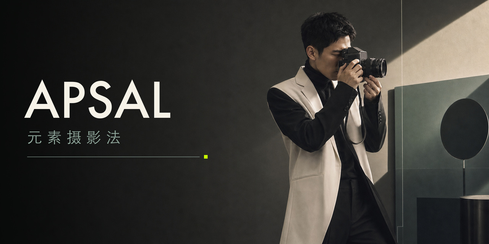
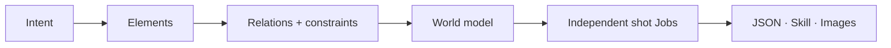

<p align="center">
  
</p>

<h1 align="center">APSAL — Open Photography Protocol</h1>

<p align="center">
  <strong>Structure the elements. Build the world.</strong><br>
  An open visual language for turning creative intent into reproducible photographic worlds.
</p>

<p align="center">
  <a href="https://github.com/henyjone/apsal-open/actions/workflows/ci.yml"></a>
  <a href="https://github.com/henyjone/apsal-open/releases/latest"></a>
  <a href="LICENSE"></a>
  <a href="CONTENT_LICENSE.md"></a>
  <a href="protocol/APSAL_OPEN_PROTOCOL.md"></a>
  <a href="plugins/apsal-studio"></a>
</p>

<p align="center">
  <a href="#install-the-codex-plugin"><strong>Install Plugin</strong></a> ·
  <a href="#30-second-start"><strong>Quick Start</strong></a> ·
  <a href="protocol/APSAL_OPEN_PROTOCOL.md"><strong>Read Protocol</strong></a> ·
  <a href="docs/monograph/README.md"><strong>Read the Method</strong></a> ·
  <a href="README.zh-CN.md"><strong>中文文档</strong></a>
</p>

---

## AI photography is worldbuilding

AI photography is not the act of writing one enormous prompt. It is the act of defining a world: its subjects, space, light, time, visual laws, events, and points of view—then expressing those elements in a language that can be composed, tested, versioned, and reproduced.

APSAL is that open visual language. It turns creative intuition into explicit elements, relationships, and constraints, then compiles them into independent photographic Jobs.



| ELEMENTS | GRAMMAR | WORLD | CAMERA | OUTPUT |
|---|---|---|---|---|
| Identity, space, light, color, style, action | Dependencies, locks, variants, continuity | A coherent visual system with memory | One point of view per independent Job | Validated JSON, prompts and installable Skills |

> **Prompting describes an image. APSAL defines the world that makes the image possible.**

## The open system behind the idea

The protocol defines 13 composable module roles. The DNA Registry stores reusable visual elements. The engine resolves versions and dependencies, validates identity and continuity, and packages the result without requiring a hosted service.

## Install the Codex plugin

The Git marketplace is the recommended path. It installs the protocol, DNA Registry, validator, compiler, templates, and Skill packager together.

```bash
codex plugin marketplace add henyjone/apsal-open --ref main
codex plugin add apsal-studio@apsal-open
```

Restart Codex or open a new task after installation. You can also download the pinned ZIP from the [latest release](https://github.com/henyjone/apsal-open/releases/latest).

## 30-second start

Ask Codex:

> Use APSAL Studio to create a nine-shot Eastern-minimalist window portrait theme. Keep one fictional adult identity, make every shot narratively distinct, validate the package, and export an installable Skill.

APSAL Studio will:

1. Select exact, versioned assets from the bundled DNA Registry.
2. Create independent shot definitions with identity and continuity locks.
3. Validate rights, lineage, checksums, filenames, and output rules.
4. Export canonical JSON, compiled shot prompts, and a reproducible Skill ZIP.

Expected artifacts:

```text
theme.json
compiled.json
your-theme-1-0-0.zip
your-theme-1-0-0.zip.sha256
```

## Use the engine directly

No account, hosted API, or model key is required for validation and packaging.

```bash
python3 plugins/apsal-studio/scripts/apsal.py catalog
python3 plugins/apsal-studio/scripts/apsal.py validate examples/quiet-window/theme.json
python3 plugins/apsal-studio/scripts/apsal.py compile examples/quiet-window/theme.json -o build/compiled.json
python3 plugins/apsal-studio/scripts/apsal.py pack examples/quiet-window/theme.json -o build
python3 plugins/apsal-studio/scripts/apsal.py validate-package path/to/extracted-package
```

## Choose your path

| Creator | Developer | Contributor |
|---|---|---|
| Describe a theme in Codex and receive a validated package. | Build against the [protocol](protocol/APSAL_OPEN_PROTOCOL.md), [schemas](plugins/apsal-studio/assets/schemas), and offline CLI. | Submit original DNA through the [DNA template](https://github.com/henyjone/apsal-open/issues/new?template=dna-submission.yml) and follow [CONTRIBUTING.md](CONTRIBUTING.md). |

## Open does not mean unlicensed

The protocol and reference engine are Apache-2.0. Official starter DNA and examples are CC BY 4.0. An individual theme is public only when it carries its own license, attribution, provenance, version lineage, checksums, and honest QA state. Private references, credentials, personal media, and unlicensed source material are excluded.

Static validation proves structure and reproducibility—not generated-image quality. Visual QA requires human evidence.

## Project map

- [Building Visible Worlds — APSAL methodology monograph](docs/monograph/README.md)
- [APSAL Open Protocol](protocol/APSAL_OPEN_PROTOCOL.md)
- [APSAL Studio plugin](plugins/apsal-studio)
- [Starter DNA Registry](plugins/apsal-studio/assets/dna/catalog.json)
- [Example theme](examples/quiet-window/theme.json)
- [Contribution guide](CONTRIBUTING.md)
- [Governance](GOVERNANCE.md)
- [Security policy](SECURITY.md)
- [Latest release](https://github.com/henyjone/apsal-open/releases/latest)

<p align="center"><strong>Ideas become assets. Assets become reproducible photo systems.</strong></p>
