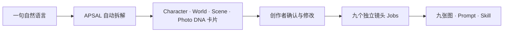

<p align="center">
  
</p>

<h1 align="center">APSAL — 开放摄影生成协议</h1>

<p align="center"><strong>结构元素，构建世界。</strong><br>把创作意图转译为可组合、可验证、可复现的摄影世界。</p>

<p align="center">
  <a href="https://github.com/henyjone/apsal-open/actions/workflows/ci.yml"></a>
  <a href="https://github.com/henyjone/apsal-open/releases/latest"></a>
  <a href="LICENSE"></a>
  <a href="CONTENT_LICENSE.md"></a>
</p>

<p align="center"><a href="README.md">English</a> · <a href="#安装-codex-插件">安装插件</a> · <a href="#30-秒开始使用">快速开始</a> · <a href="docs/monograph/README.md">阅读方法论专著</a> · <a href="protocol/APSAL_OPEN_PROTOCOL.md">阅读协议</a></p>

---

## AI 摄影的本质，是构建世界

AI 摄影不是写出一段更长的 Prompt，而是定义一个世界：谁存在于其中，空间怎样组织，光从哪里来，时间如何流动，事件怎样发生，相机以什么视点观看。

APSAL 是描述这个世界的开放视觉语言。它把模糊的创作直觉拆解为明确的**元素、关系与约束**，再将它们编译为可独立执行的摄影 Job。



| 元素 ELEMENTS | 语法 GRAMMAR | 世界 WORLD | 相机 CAMERA | 输出 OUTPUT |
|---|---|---|---|---|
| 身份、空间、光、色彩、风格、行动 | 依赖、锁定、变体、连续性 | 一个拥有记忆的统一视觉系统 | 每个 Job 对应一个独立观看视点 | 通过校验的 JSON、Prompt 与 Skill |

> **Prompt 描述一张图；APSAL 定义让这张图得以成立的世界。**

## 思想背后的开放系统

协议定义 13 类可组合模块；DNA Registry 保存可复用的视觉元素；引擎解析版本和依赖，校验身份与连续性，并在不依赖托管服务的情况下完成可复现打包。

## 安装 Codex 插件

推荐通过 Git marketplace 安装，协议、官方 DNA、本地引擎、卡片交互服务和打包器会一起进入 Codex：

```bash
codex plugin marketplace add henyjone/apsal-open --ref main
codex plugin add apsal-studio@apsal-open
```

安装后重新启动 Codex，或打开一个新任务。也可以从[最新 Release](https://github.com/henyjone/apsal-open/releases/latest)下载固定版本插件 ZIP。

## 30 秒开始使用

直接告诉 Codex：

> 创建一套九张东方极简窗边人像主题。

插件会完成：

1. 自动拆解这句话，依次显示 Character、World、Scene、Photo DNA 卡片。
2. 让你点击选择，也可以直接说“人物更成熟，但保留短发”或“重新设计第 4 镜”。
3. 展示九镜头总览，等你确认后再执行。
4. 逐张生成九张独立图片，或只保存 Prompt、导出可复现 Skill。

创作者不需要看见或手写 JSON/YAML。Protocol 0.3 把它们保留在本地资产层，用来复用、编辑、版本管理、编译和 QA。图片生成前必须明确确认一次；始终一 Job 一张图，单镜失败不会重做已经成功的镜头。

### DNA 保存在哪里

| 层级 | 位置 | 用途 |
|---|---|---|
| 官方 | 安装插件内部 | 只读、权利清晰的起步 DNA 与预览 |
| 个人 | `~/.apsal/` 或 `APSAL_HOME` | 跨项目复用的个人 DNA，以及私有参考图 Vault |
| 项目 | `<project>/.apsal/` | 草稿、项目 DNA、主题、精确 Prompt、运行记录、图片与 QA |

解析顺序是“项目 → 个人 → 官方”。确认后的草稿先成为项目 DNA；只有你明确选择“保存到我的 DNA”，才会复制到个人库。人物参考图只进入 `~/.apsal/vault/sha256/`，不会写入 DNA JSON、Git 或导出的 Skill。

界面背后，最终主题与每次真实生成都会留下完整血缘：

```text
.apsal/themes/<theme-id>/<version>/   创作源、规范资产、三类编译结果与 18 个 Prompt 文件
.apsal/runs/<run-id>/                 实际 Prompt、九张输出、失败重试与逐镜 QA
```

## 直接使用本地引擎

验证和打包不需要 APSAL 账号、托管 API 或模型密钥：

```bash
python3 plugins/apsal-studio/scripts/apsal.py init
python3 plugins/apsal-studio/scripts/apsal.py session start "创建一套九张东方极简窗边人像主题"
python3 plugins/apsal-studio/scripts/apsal.py registry search --stage character
python3 plugins/apsal-studio/scripts/apsal.py catalog
python3 plugins/apsal-studio/scripts/apsal.py validate examples/quiet-window/theme.apsal.yaml
python3 plugins/apsal-studio/scripts/apsal.py normalize examples/quiet-window/theme.apsal.yaml -o build/theme.apsal.json
python3 plugins/apsal-studio/scripts/apsal.py explain examples/quiet-window/theme.apsal.yaml --path shots.SHOT_04.framing
python3 plugins/apsal-studio/scripts/apsal.py compile examples/quiet-window/theme.apsal.yaml --target design -o build/design.json
python3 plugins/apsal-studio/scripts/apsal.py compile examples/quiet-window/theme.apsal.yaml --target image -o build/image.json
python3 plugins/apsal-studio/scripts/apsal.py compile examples/quiet-window/theme.apsal.yaml --target qa -o build/qa.json
python3 plugins/apsal-studio/scripts/apsal.py check-sync examples/quiet-window
python3 plugins/apsal-studio/scripts/apsal.py pack examples/quiet-window/theme.apsal.yaml -o build
python3 plugins/apsal-studio/scripts/apsal.py validate-package path/to/extracted-package
```

## 你可以怎样参与

| 创作者 | 开发者 | 贡献者 |
|---|---|---|
| 用一句话构建世界，选择 DNA 卡片，再生成九张独立图片。 | 基于[协议](protocol/APSAL_OPEN_PROTOCOL.md)、[Schema](plugins/apsal-studio/assets/schemas)、本地 MCP 和 CLI 开发工具。 | 使用 [DNA 投稿模板](https://github.com/henyjone/apsal-open/issues/new?template=dna-submission.yml)贡献原创资产。 |

## 开放不等于无授权

协议与参考引擎采用 Apache-2.0；官方起步 DNA 和示例采用 CC BY 4.0。任何主题只有在明确声明许可证、署名、来源、版本血缘、校验和与 QA 状态后，才能作为开放内容发布。

静态校验只能证明结构与可复现性，不能证明生成图片已经通过人工视觉 QA。

## 项目导航

- [《构建可见世界：APSAL 元素摄影法》](docs/monograph/README.md)
- [Semantic Contract RFC](protocol/RFC-0001-SEMANTIC-CONTRACT.md)
- [本地 Registry 与对话创作 RFC](protocol/RFC-0002-LOCAL-REGISTRY-AND-CONVERSATIONAL-AUTHORING.md)
- [APSAL Studio 0.4 发布与安装说明](docs/releases/0.4.0.md)
- [《窗边未寄》语义契约试点](examples/quiet-window/theme.apsal.yaml)
- [APSAL Open Protocol](protocol/APSAL_OPEN_PROTOCOL.md)
- [APSAL Studio 插件](plugins/apsal-studio)
- [DNA Registry](plugins/apsal-studio/assets/dna/catalog.json)
- [语义化示例主题](examples/quiet-window/theme.apsal.yaml)
- [贡献指南](CONTRIBUTING.md)
- [治理规则](GOVERNANCE.md)
- [安全策略](SECURITY.md)
- [最新 Release](https://github.com/henyjone/apsal-open/releases/latest)

<p align="center"><strong>让创意成为资产，让资产成为可复现的摄影系统。</strong></p>
