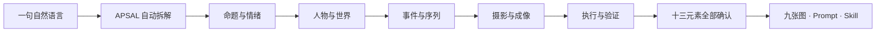

<p align="center">
  
</p>

<p align="center">
  <strong>联系方式</strong><br>
  Email：<a href="mailto:henyjone@gmail.com">henyjone@gmail.com</a> &nbsp;·&nbsp; WeChat：<strong>vip888666</strong>
</p>

<h1 align="center">APSAL — 开放摄影生成协议</h1>

<p align="center"><strong>结构元素，构建世界。</strong><br>把创作意图转译为可组合、可验证、可复现的摄影世界。</p>

<p align="center">
  <a href="https://github.com/henyjone/apsal-open/actions/workflows/ci.yml"></a>
  <a href="https://github.com/henyjone/apsal-open/releases/latest"></a>
  <a href="LICENSE"></a>
  <a href="CONTENT_LICENSE.md"></a>
</p>

<p align="center"><a href="README.md">English</a> · <a href="#安装-codex-插件">安装插件</a> · <a href="#30-秒开始使用">快速开始</a> · <a href="docs/USAGE_GUIDE.zh-CN.md"><strong>完整使用手册</strong></a> · <a href="docs/monograph/README.md">阅读方法论专著</a> · <a href="protocol/APSAL_OPEN_PROTOCOL.md">阅读协议</a></p>

---

## AI 摄影的本质，是构建世界

AI 摄影不是写出一段更长的 Prompt，而是定义一个世界：谁存在于其中，空间怎样组织，光从哪里来，时间如何流动，事件怎样发生，相机以什么视点观看。

APSAL 是描述这个世界的开放视觉语言。它把模糊的创作直觉拆解为明确的**元素、关系与约束**，再将它们编译为可独立执行的摄影 Job。



| 元素 ELEMENTS | 语法 GRAMMAR | 世界 WORLD | 相机 CAMERA | 输出 OUTPUT |
|---|---|---|---|---|
| 身份、空间、光、色彩、风格、行动 | 依赖、锁定、变体、连续性 | 一个拥有记忆的统一视觉系统 | 每个 Job 对应一个独立观看视点 | 通过校验的 JSON、Prompt 与 Skill |

> **Prompt 描述一张图；APSAL 定义让这张图得以成立的世界。**

## 思想背后的开放系统

协议定义 13 类可组合角色；DNA Registry 保存七类可复用视觉知识；Studio 以五层完整文字卡片让创作者逐项确认，并用五张中文语义缩略图概括设计进度，避免人物、道具、情绪、灯光、色调、后期或 QA 被藏进一个笼统的“摄影风格”。DNA 选择仍然是纯文字卡片；阶段缩略图只帮助理解设计，不参与图像生成。引擎会解释哪些 DNA 适合当前场景，只记住创作者明确同意沉淀的个人方法，解析版本与依赖，并在不依赖托管服务的情况下打包主题或独立 DNA。

| 创作层 | 必须确认的 APSAL 元素 | 推荐的 Registry DNA |
|---|---|---|
| 命题与情绪 | Content、Emotion | 无；从自然语言提出方案 |
| 人物与世界 | Subject、World、Look | Character、Environment |
| 事件与序列 | Event、Sequence | Composition、Shot |
| 摄影与成像 | Camera、Light、Style、Color/Post | Style、Lighting |
| 执行与验证 | Job、Quality Control | QA |

五层是对话顺序，十三元素是协议角色，七类 DNA 是可复用资产；三者各司其职。

## 安装 Codex 插件

推荐通过 Git marketplace 安装，协议、官方 DNA、本地引擎、卡片交互服务和打包器会一起进入 Codex：

```bash
codex plugin marketplace add henyjone/apsal-open --ref main
codex plugin add apsal-studio@apsal-open
```

安装后重新启动 Codex，或打开一个新任务。也可以从[最新 Release](https://github.com/henyjone/apsal-open/releases/latest)下载固定版本插件 ZIP。

APSAL Studio 已完整支持中文和英文。插件默认跟随当前 Codex 对话：中文输入显示纯中文创作卡片与中文阶段缩略图，不再暴露英文机器角色名、字段名、状态、来源、资源编号或推荐标签；英文输入显示英文版本。每张元素卡都直接填入“我的设计提案、为什么这样建议、可调整方向、建议取值、应当看到、必须保持、验收标准”，不再把关键建议留空或散落在卡片外。重要标题、提案、取值、匹配理由、已选状态和主确认按钮使用可访问的青瓷高亮层级。安装时不会强制弹出语言选择；只有第一条有效信息太短、混合或无法判断时，才会询问一次“English or 中文?”。你也可以随时切换语言，且不会改变主题、资源或提示词摘要。

新建九张套片默认采用**章节式丰富变化**：三个关联场景、三套相互协调的妆造、九种由行动驱动的身体状态，以及按镜头职能变化的多种焦段；人物身份、真人摄影媒介、世界规则和色彩体系保持统一。如果更强调同一场景、同一妆造和事件连续，可以选择**连续叙事**。两个选项都在第一张卡片中直接点击；点击会先更新方案，不会跳过确认。

### APSAL Studio 0.2.0 桌面前端

同一仓库现在包含 [`apps/apsal-studio`](apps/apsal-studio)：它是 Codex 插件的可视前端，只显示同一个 `.apsal/` 项目的五层十三元素、待确认变更、revision 和只读语义。它不保留旧 AiPhoto 工作流，不使用 IndexedDB 维护第二份项目，也不包含 ComfyUI、MLX、模型、供应商设置或本地生图入口。

```bash
cd apps/apsal-studio
npm ci
npm run build
npm run test:electron
npm run desktop:start
```

联动默认关闭；在 Studio 中打开项目并明确开启后，Codex 插件才会通过仅监听 `127.0.0.1` 的认证桥连接。Studio 关闭或未联动时，Codex 插件仍可直接使用同一 Engine 完成全部创作与打包。

## 30 秒开始使用

直接告诉 Codex：

> 创建一套九张东方极简窗边人像主题。

插件会完成：

1. 先确认“作品关于什么”，选择“章节式丰富变化”或“连续叙事”，再确认总体情绪与九镜情绪弧线。
2. 再用完整提案卡依次确认人物与世界、事件与序列、摄影与成像、执行与验证；七类元素资源都会按场景推荐并说明理由。若未指定其他人物，默认提案是一位非常有气质、镜头表现稳定、适合古典、当代、编辑与礼服等多种妆造的东亚成年女主角，同时锁定身份，避免换妆造变成换脸。
3. 单独确认三场景三妆造章节方案或单场景连续锁定、九种不同动作与身体状态、按职能变化的焦段、道具归属、灯光、色彩后期和拒绝条件；既可以用自然语言修改，也可以直接点击卡片中的建议方向。
4. 为新 DNA 建议受控标签，再询问“保存到我的 DNA、仅当前项目，还是稍后决定”。
5. 展示十三元素与九镜头总览，同时自动打包全部 Prompt、真实参考图、五阶段缩略图和使用说明。真实参考图存在时指定一个核心视觉锚点；缩略图始终单独存放，绝不冒充参考图。你确认一次后，由 Codex 逐张生成九张独立的 9:16 图片。

创作者不需要看见或手写结构化文件。开放资产协议与语义契约仍为 0.3；APSAL Project Protocol、Engine 与 Codex 插件为 0.15.0，桌面前端为 0.2.0。Codex 和 Studio 只读取同一个 `.apsal/` 真源，最终主题会生成同时带完整中英文说明的提示词与技能使用包，再由 Codex 逐张生成。

从安装、五层对话、DNA 与参考图，到逐张生成、安装主题 Skill 和排查问题，请直接按照 [APSAL Studio 中文完整使用手册](docs/USAGE_GUIDE.zh-CN.md) 操作。

### 已经有旧版 APSAL ZIP？

把 ZIP 直接交给 Codex，然后说：

> 打开这个 APSAL 包并生成第一张图。

Studio 会自动识别 `run.json`：保留原始血缘，但不再执行旧的 API、模型和供应商字段；恢复全部 Prompt；按 SHA-256 从 ZIP 和你的私人 Vault 中寻找参考图；重新生成私人 Codex Prompt/Skill 包，并把 SHOT_01 直接准备给 Codex。你不需要解压、阅读 JSON、修复旧电脑绝对路径或寻找 API 运行器。只有确实无法恢复的参考图，Studio 才会请你重新提供，并用原摘要核对。

### DNA 保存在哪里

| 层级 | 位置 | 用途 |
|---|---|---|
| 官方 | 安装插件内部 | 只读、权利清晰的起步 DNA 与预览 |
| 个人 | `~/.apsal/` 或 `APSAL_HOME` | 跨项目复用的个人 DNA，以及私有参考图 Vault |
| 扩展 | `~/.apsal/extensions/` | 已安装、不可原地修改的社区 DNA Pack |
| 项目 | `<project>/.apsal/` | 草稿、项目 DNA、主题、精确 Prompt、运行记录、图片与 QA |

解析顺序是“项目 → 个人 → 扩展 → 官方”。确认后的草稿先成为项目 DNA；只有你明确选择“保存到我的 DNA”，才会复制到个人库。选择与结果记忆只保存在 `~/.apsal/usage/`，不保存原始创作描述。参考图原件进入 `~/.apsal/vault/sha256/`，不会写入 DNA JSON 或 Git。导出的本地 Skill 会包含清理后的副本和用途/权利清单，并在存在真实参考图时明确一张核心视觉锚点，让 Codex 真正看到图片；权利未解决时只能打包为 `private_only`，公开导出会失败。五阶段 SVG 缩略图保存在 `assets/previews/`，标记为不参与生成，不会被传给图像模型。

界面背后，最终主题与每次真实生成都会留下完整血缘：

```text
.apsal/themes/<theme-id>/<version>/   创作源、规范资产、三类编译结果与 18 个 Prompt 文件
.apsal/runs/<run-id>/                 实际 Prompt、九张输出、失败重试与逐镜 QA
```

### 真人、真参考图、Codex 内直接生成

Studio 新主题默认要求真实成年人的实拍摄影呈现，并请求九张独立的 9:16 高质量图片。布景和道具可以保留手绘、蜡笔、绘画或戏剧化语言，但人物不能变成插画、动漫、玩偶、人体模型、蜡像或 3D 角色。

APSAL Studio 是 Codex 专用插件，因此不会配置供应商接口、读取图像 API Key，也不会发送 HTTP 生图请求。它为每一镜冻结一份完整 Prompt，把允许使用的真实参考图交给 Codex 内置图像生成。2160×3840 仍会作为创作交付目标写入提示词包，但不冒充 Codex 必然返回的像素尺寸；只有 Codex 实际提供的格式和尺寸才会进入运行记录，否则统一标记为 `not_reported`。

模型视觉检查会检查媒介、皮肤、眼睛、手部、人体结构、光学景深、光线和材质；人工视觉 QA 仍单独保持 pending。Schema 或 Prompt 通过，不能证明成片已经是真人摄影。

### 经你允许，Registry 才会越用越懂你

推荐会综合受控语义标签、场景 facets、明确依赖、QA、权利、Registry 层级和私有使用结果。每张卡片都会解释为什么匹配。只有新建或修改的项目 DNA 才询问是否保存到个人库，APSAL 不会静默入库。

可复用 DNA 可以脱离主题，独立导出为确定性的 Extension Pack。公开包必须具备统一 namespace、已确认标签、权利清晰的 DNA 与预览、署名、已解析依赖和 SHA-256。安装固定 GitHub Release 包：

```bash
python3 plugins/apsal-studio/scripts/apsal.py registry install 'github:owner/repo@v1.0.0#my-pack-v1.0.0.zip'
```

安装包只读，不能覆盖官方或已有的同 ID/版本资产。

## 直接使用本地引擎

验证和打包不需要 APSAL 账号、托管 API 或模型密钥：

```bash
python3 plugins/apsal-studio/scripts/apsal.py init
python3 plugins/apsal-studio/scripts/apsal.py import-run path/to/legacy-run.zip
python3 plugins/apsal-studio/scripts/apsal.py session start "创建一套九张东方极简窗边人像主题"
python3 plugins/apsal-studio/scripts/apsal.py registry recommend-layer "安静的东方极简窗边人像" --layer worldbuilding
python3 plugins/apsal-studio/scripts/apsal.py session layer-show SESSION-ID --layer direction
python3 plugins/apsal-studio/scripts/apsal.py registry search --stage character
python3 plugins/apsal-studio/scripts/apsal.py catalog
python3 plugins/apsal-studio/scripts/apsal.py validate examples/quiet-window/theme.apsal.yaml
python3 plugins/apsal-studio/scripts/apsal.py normalize examples/quiet-window/theme.apsal.yaml -o build/theme.apsal.json
python3 plugins/apsal-studio/scripts/apsal.py explain examples/quiet-window/theme.apsal.yaml --path shots.SHOT_04.framing
python3 plugins/apsal-studio/scripts/apsal.py compile examples/quiet-window/theme.apsal.yaml --target design -o build/design.json
python3 plugins/apsal-studio/scripts/apsal.py compile examples/quiet-window/theme.apsal.yaml --target image -o build/image.json
python3 plugins/apsal-studio/scripts/apsal.py compile examples/quiet-window/theme.apsal.yaml --target qa -o build/qa.json
python3 plugins/apsal-studio/scripts/apsal.py check-sync examples/quiet-window
python3 plugins/apsal-studio/scripts/apsal.py pack examples/quiet-window/theme.apsal.yaml -o build
python3 plugins/apsal-studio/scripts/apsal.py validate-package path/to/extracted-package
```

本地流程使用 `session finalize` 生成主题及 Codex Prompt/Skill ZIP，使用 `run --confirm` 建立可续跑任务，使用 `run-next` 查看下一份冻结的 Codex Job，使用 `run-model-qa` 保存视觉检查。CLI 不连接供应商生成图片，真正生图发生在 Codex 内。验证与打包仍可完全离线运行。

## 你可以怎样参与

| 创作者 | 开发者 | 贡献者 |
|---|---|---|
| 用一句话构建世界，选择 DNA 卡片，再生成九张独立图片。 | 基于[协议](protocol/APSAL_OPEN_PROTOCOL.md)、[Schema](plugins/apsal-studio/assets/schemas)、本地 MCP 和 CLI 开发工具。 | 使用 [DNA 投稿模板](https://github.com/henyjone/apsal-open/issues/new?template=dna-submission.yml)贡献原创资产。 |

## 开放不等于无授权

协议与参考引擎采用 Apache-2.0；官方起步 DNA 和示例采用 CC BY 4.0。任何主题只有在明确声明许可证、署名、来源、版本血缘、校验和与 QA 状态后，才能作为开放内容发布。参考图拥有独立许可与肖像授权记录，不会自动继承主题文字的 CC BY 4.0；私人或权利未明媒体不会进入本仓库和公开 Release。

静态校验只能证明结构与可复现性，不能证明生成图片已经通过人工视觉 QA。

## 项目导航

- [GitHub 文档中心](docs/README.md)
- [APSAL Studio 中文完整使用手册](docs/USAGE_GUIDE.zh-CN.md)
- [APSAL Studio Complete Usage Guide](docs/USAGE_GUIDE.md)
- [《构建可见世界：APSAL 元素摄影法》](docs/monograph/README.md)
- [Semantic Contract RFC](protocol/RFC-0001-SEMANTIC-CONTRACT.md)
- [本地 Registry 与对话创作 RFC](protocol/RFC-0002-LOCAL-REGISTRY-AND-CONVERSATIONAL-AUTHORING.md)
- [参考图绑定、真人摄影与原生 4K RFC](protocol/RFC-0003-REFERENCE-BINDING-LIVE-ACTION-AND-NATIVE-4K.md)
- [DNA 推荐、记忆与交换 RFC](protocol/RFC-0004-DNA-RECOMMENDATION-MEMORY-AND-EXCHANGE.md)
- [五层创作与十三元素 RFC](protocol/RFC-0005-FIVE-LAYER-THIRTEEN-ELEMENT-AUTHORING.md)
- [Codex 原生生图与 Prompt 交付 RFC](protocol/RFC-0006-CODEX-NATIVE-GENERATION-AND-PROMPT-DELIVERY.md)
- [旧运行包自动接管 RFC](protocol/RFC-0007-LEGACY-RUN-TAKEOVER.md)
- [中英文交互 RFC](protocol/RFC-0008-BILINGUAL-INTERACTION.md)
- [受控变化与套片组织策略 RFC](protocol/RFC-0009-CONTROLLED-VARIATION-SET-STRATEGY.md)
- [视觉锚点与阶段缩略图 RFC](protocol/RFC-0010-VISUAL-ANCHOR-AND-STAGE-PREVIEWS.md)
- [APSAL 0.15.0 升级实施规格](docs/UPGRADE_GUIDE_0.15.0.zh-CN.md)
- [APSAL Studio 0.15.0 发布与安装说明](docs/releases/0.15.0.md)
- [《窗边未寄》语义契约试点](examples/quiet-window/theme.apsal.yaml)
- [APSAL Open Protocol](protocol/APSAL_OPEN_PROTOCOL.md)
- [APSAL Studio 插件](plugins/apsal-studio)
- [APSAL Studio 0.2.0 桌面前端](apps/apsal-studio)
- [DNA Registry](plugins/apsal-studio/assets/dna/catalog.json)
- [语义化示例主题](examples/quiet-window/theme.apsal.yaml)
- [贡献指南](CONTRIBUTING.md)
- [治理规则](GOVERNANCE.md)
- [安全策略](SECURITY.md)
- [最新 Release](https://github.com/henyjone/apsal-open/releases/latest)

<p align="center"><strong>让创意成为资产，让资产成为可复现的摄影系统。</strong></p>
