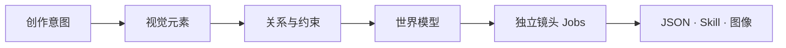

<p align="center">
  
</p>

<h1 align="center">APSAL — 开放摄影生成协议</h1>

<p align="center"><strong>结构元素，构建世界。</strong><br>把创作意图转译为可组合、可验证、可复现的摄影世界。</p>

<p align="center">
  <a href="https://github.com/henyjone/apsal-open/actions/workflows/ci.yml"></a>
  <a href="https://github.com/henyjone/apsal-open/releases/latest"></a>
  <a href="LICENSE"></a>
  <a href="CONTENT_LICENSE.md"></a>
</p>

<p align="center"><a href="README.md">English</a> · <a href="#安装-codex-插件">安装插件</a> · <a href="#30-秒开始使用">快速开始</a> · <a href="protocol/APSAL_OPEN_PROTOCOL.md">阅读协议</a></p>

---

## AI 摄影的本质，是构建世界

AI 摄影不是写出一段更长的 Prompt，而是定义一个世界：谁存在于其中，空间怎样组织，光从哪里来，时间如何流动，事件怎样发生，相机以什么视点观看。

APSAL 是描述这个世界的开放视觉语言。它把模糊的创作直觉拆解为明确的**元素、关系与约束**，再将它们编译为可独立执行的摄影 Job。



| 元素 ELEMENTS | 语法 GRAMMAR | 世界 WORLD | 相机 CAMERA | 输出 OUTPUT |
|---|---|---|---|---|
| 身份、空间、光、色彩、风格、行动 | 依赖、锁定、变体、连续性 | 一个拥有记忆的统一视觉系统 | 每个 Job 对应一个独立观看视点 | 通过校验的 JSON、Prompt 与 Skill |

> **Prompt 描述一张图；APSAL 定义让这张图得以成立的世界。**

## 思想背后的开放系统

协议定义 13 类可组合模块；DNA Registry 保存可复用的视觉元素；引擎解析版本和依赖，校验身份与连续性，并在不依赖托管服务的情况下完成可复现打包。

## 安装 Codex 插件

推荐通过 Git marketplace 安装，协议、DNA、引擎和打包器会一起进入 Codex：

```bash
codex plugin marketplace add henyjone/apsal-open --ref main
codex plugin add apsal-studio@apsal-open
```

安装后重新启动 Codex，或打开一个新任务。也可以从[最新 Release](https://github.com/henyjone/apsal-open/releases/latest)下载固定版本插件 ZIP。

## 30 秒开始使用

直接告诉 Codex：

> 使用 APSAL Studio 创建一套九张东方极简窗边人像主题。固定同一个虚构成年人物，让每张照片承担不同叙事功能，完成协议校验，并导出可安装 Skill。

插件会完成：

1. 从内置 DNA Registry 选择精确版本资产。
2. 建立人物、世界和连续性锁定的独立镜头。
3. 校验权利、版本血缘、SHA-256、输出文件名和单图规则。
4. 输出主题 JSON、逐镜头编译结果和可复现 Skill ZIP。

```text
theme.json
compiled.json
your-theme-1-0-0.zip
your-theme-1-0-0.zip.sha256
```

## 直接使用本地引擎

验证和打包不需要 APSAL 账号、托管 API 或模型密钥：

```bash
python3 plugins/apsal-studio/scripts/apsal.py catalog
python3 plugins/apsal-studio/scripts/apsal.py validate examples/quiet-window/theme.json
python3 plugins/apsal-studio/scripts/apsal.py compile examples/quiet-window/theme.json -o build/compiled.json
python3 plugins/apsal-studio/scripts/apsal.py pack examples/quiet-window/theme.json -o build
python3 plugins/apsal-studio/scripts/apsal.py validate-package path/to/extracted-package
```

## 你可以怎样参与

| 创作者 | 开发者 | 贡献者 |
|---|---|---|
| 用自然语言创作主题并获得通过校验的包。 | 基于[协议](protocol/APSAL_OPEN_PROTOCOL.md)、[Schema](plugins/apsal-studio/assets/schemas)和 CLI 开发工具。 | 使用 [DNA 投稿模板](https://github.com/henyjone/apsal-open/issues/new?template=dna-submission.yml)贡献原创资产。 |

## 开放不等于无授权

协议与参考引擎采用 Apache-2.0；官方起步 DNA 和示例采用 CC BY 4.0。任何主题只有在明确声明许可证、署名、来源、版本血缘、校验和与 QA 状态后，才能作为开放内容发布。

静态校验只能证明结构与可复现性，不能证明生成图片已经通过人工视觉 QA。

## 项目导航

- [APSAL Open Protocol](protocol/APSAL_OPEN_PROTOCOL.md)
- [APSAL Studio 插件](plugins/apsal-studio)
- [DNA Registry](plugins/apsal-studio/assets/dna/catalog.json)
- [示例主题](examples/quiet-window/theme.json)
- [贡献指南](CONTRIBUTING.md)
- [治理规则](GOVERNANCE.md)
- [安全策略](SECURITY.md)
- [最新 Release](https://github.com/henyjone/apsal-open/releases/latest)

<p align="center"><strong>让创意成为资产，让资产成为可复现的摄影系统。</strong></p>
